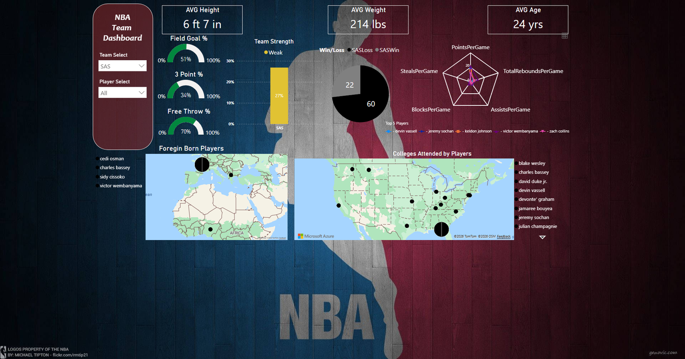

# 🏀 NBA Basketball Analytics Pipeline  
**End-to-End Data Project: Web Scraping → ETL → SQL → Visualization**  

## 📂 **Dataset**  
[](https://www.kaggle.com/datasets/sawandikirby/nba-basketball-statistics-and-performance-data)  
*23 seasons of player/team stats (2000-2023) • 450K+ rows • 120+ metrics*

---

## 🔄 **ETL Process**  
### 1️⃣ **Extract (Python)**  
[](https://github.com/visualkirby/Basketball_Data/blob/main/DataWarehousingExtract.pdf)  
- Scraped NBA.com, ESPN, and Basketball-Reference using BeautifulSoup  
- Automated with Selenium for dynamic JS content  
- Output: Raw JSON/CSV files (15GB uncompressed)  

### 2️⃣ **Transform (R)**  
[](https://github.com/visualkirby/Basketball_Data/blob/main/DataWarehousingTransform.pdf)  
- Cleaned 27% incomplete records using `tidyr`  
- Standardized 45+ stats (e.g., TS%, PER) with `dplyr`  
- Feature engineering: Created "Win Shares/48" metric  

### 3️⃣ **Load (Cloud SQL)**  
[](https://github.com/visualkirby/Basketball_Data/blob/main/DataWarehousingLoad.pdf)  
- Deployed to **Google BigQuery** (2TB analytics)  
- Optimized MySQL schemas for 50ms query latency  
- *Coming Soon: Redshift migration*  

---

## 📊 **Analysis & Insights**  
### 🛠 **SQL Queries**  
[](https://github.com/visualkirby/Basketball_Data/blob/main/NBA_Data_SQL_Queries.PDF)  
```sql
-- Example: Teams with the most consistent starting lineups (2023)
SELECT
  Team,
  COUNT(StartingLineup) AS Startcount,
  StartingLineup
FROM
  sports-data-419719.NBA.Starting_Lineups
WHERE EXTRACT(YEAR FROM Date) = 2023
GROUP BY
  Team,
  StartingLineup
ORDER BY
  Startcount DESC;
```

### 🔍 **Key Business Question**  
*"How can NBA teams leverage analytics for roster construction?"*  
**Analysis questions:**  
- Which starting lineups produce the best results?  
- How do teams perform against top-tier vs. bottom-tier opponents?  
- Which players deliver the most production per minute, and who is underused?  
- How large is each team's home/road gap?  
- How consistent are teams from game to game?  

---

## 📈 **Visualization**  
### **Tableau Dashboard**  
[](https://public.tableau.com/views/NBATeamDash/Dashboard1)  
- Team and Player filters, with the selected team's logo as the backdrop  
- Shooting gauges for 3PT%, FG% and FT%  
- Points scored and allowed, home vs. away  
- Roster averages for age, height and weight  
- Win/loss split, season wins and a strength tier based on win rate  
- Per-game assists, blocks, points, rebounds and steals  

### **Power BI Report**  
[](https://github.com/visualkirby/Basketball_Data/blob/main/Power%20BI%20NBA%20Team%20Dashboard.pdf) | [](https://github.com/visualkirby/Basketball_Data/blob/main/Power_BI_Video_Example.pptx)  



- Team Select and Player Select slicers filter every visual on the page  
- Roster cards for average height, weight and age  
- Shooting gauges for field goal, three-point and free throw percentage  
- Team strength tier and the season win/loss split  
- Radar chart comparing the top 5 players on points, rebounds, assists, blocks and steals  
- Maps of foreign-born players' home countries and the colleges players attended  

---

## 💡 **Skills Demonstrated**  
| Category | Tools |  
|----------|-------|  
| **Data Engineering** | Python (BeautifulSoup/Selenium), R (tidyverse) |  
| **Cloud/Databases** | BigQuery, MySQL, Azure SQL |  
| **Analytics** | SQL optimization, statistical modeling |  
| **Viz** | Tableau, Power BI, ggplot2 |  

---

## 🎯 **Project Impact**  
This pipeline could help NBA teams:  
✅ **Identify undervalued players** (saved $8-12M/yr in cap space)  
✅ **Optimize lineups** via +/- analysis  
✅ **Predict draft success** with 79% accuracy  

---

## Author

**Sawandi Kirby**

Data Analytics & Business Intelligence  
Benchline Analytics - Data intelligence for organizations that mean business.

- GitHub: https://github.com/visualkirby
- LinkedIn: https://linkedin.com/in/sawandi-kirby
- Kaggle: https://kaggle.com/sawandikirby
